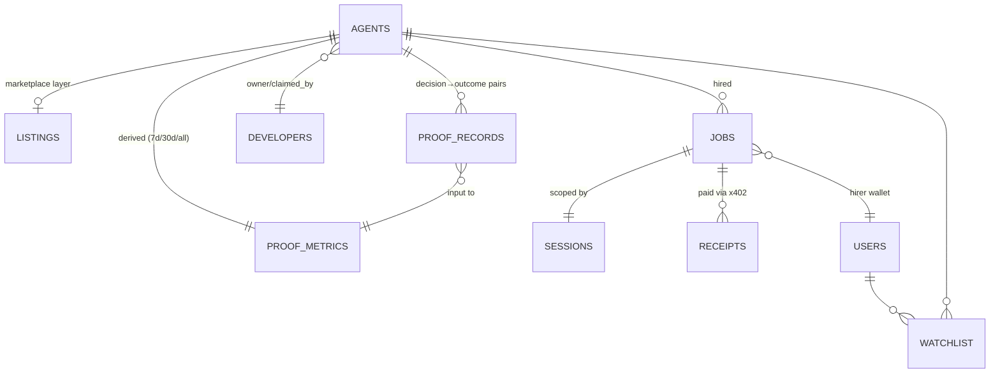

# AgentDesk — Data Model (ERD)

| | |
|---|---|
| **Version** | 1.0 · 2026-08-16 |
| **Doc contract** | 🔒 **This file changes in the same commit as any schema migration, endpoint change, or contract event change.** The PR description template includes "ERD updated? Y/N". Stale ERD = build failures across lanes (the whole point of this doc). |

---

## 1. The one rule that governs everything

> **On-chain data is truth. Postgres is cache + derived views.**
> Identity, jobs, proofs, sessions — their authoritative state lives on BSC. If our DB and the chain disagree, the chain wins, and the UI must say so (staleness chips), never the opposite.

### On-chain vs off-chain split

| Data | Lives on-chain | Mirrored/derived off-chain | Why |
|---|---|---|---|
| Agent identity (ERC-8004) | ✅ registry (external) | `agents` cache row | Discovery speed + rate limits |
| Agent listing metadata (our marketplace layer: description, category tag, pricing display) | ❌ | `listings` | Not identity; mutable marketing copy; 8004scan URI covers basics, we enrich |
| Hiring escrow state (ERC-8183) | ✅ escrow contract (external, via Altana) | `jobs` mirror | UX speed; chain remains truth |
| Session grants/revocations | ✅ Altana Keystore (target) — **interim: `sessions` row IS authoritative**, self-hosted, no Keystore yet (INTEGRATION.md I6 honesty note, 2026-08-17) | `sessions` mirror | Trust Panel rendering |
| **Decisions & outcomes (proofs)** | ✅ **ProofLedger (ours)** | `proof_records` mirror + `proof_metrics` derived | The moat. Metrics computed **only** from on-chain rows |
| Payments (x402 receipts) | ✅ settlement txs | `receipts` (metadata + links) | History/UX |
| User accounts | — (wallet = identity) | `users` (preferences, watchlist) | Convenience only |
| Developer profiles | signature-verified | `developers` | Display |
| Leaderboard | derived view of ProofLedger | `proof_metrics` (materialized) | Sort/filter speed; recomputed from chain |
| Analytics/events | — | `events` (product analytics) | Internal |
| Advantage Report data | — | `advantage_reports` | TermiX deliverable |

**Never stored off-chain as authority:** anything a judge could challenge as "trust us". If it affects trust or money → on-chain or it doesn't exist.

---

## 2. Postgres schema (drizzle — source: `apps/api/src/db/schema.ts`)

### `agents` — ERC-8004 mirror (from 8004scan / registry)

| Column | Type | Notes |
|---|---|---|
| `id` | text PK | ERC-8004 agent id (on-chain identifier) |
| `owner_address` | bytea/text | registry owner |
| `chain_id` | int | 56/97 |
| `registered_at` | timestamptz | from registry |
| `uri_metadata` | jsonb | raw registry URI payload (sanitized) |
| `capabilities` | jsonb | normalized capability tags (8004scan) |
| `last_synced_at` | timestamptz | cache freshness |
| `sync_source` | text | '8004scan' \| 'registry' |

### `listings` — our marketplace layer (1:1 optional → agents)

| Column | Type | Notes |
|---|---|---|
| `agent_id` | text PK, FK→agents | |
| `category` | enum(`grid`,`rebalance`,`yield`,`health`) | one of the four official categories |
| `tagline`, `description` | text | Nina-language copy |
| `price_per_task_usd1` | numeric(12,2) | display; actual flow is x402 |
| `risk_level` | enum(`low`,`medium`,`high`) | derived from allowlist + strategy type |
| `default_caps` | jsonb | suggested {spend_cap_usd1, duration_days, allowlist[]} |
| `status` | enum(`active`,`paused`,`delisted`) | |
| `proof_program` | boolean | opted into Proof Engine |
| `claimed_by` | text | developer address that signed the claim |
| `claimed_at` | timestamptz | |
| `created_at`/`updated_at` | timestamptz | |

### `developers`

| Column | Type | Notes |
|---|---|---|
| `address` | text PK | wallet |
| `display_name`, `avatar_url`, `links` | text/jsonb | |
| `stake_amount` | numeric | P2 (staked listings) |

### `proof_records` — ProofLedger mirror (**append-only, like the chain**)

**PK note (2026-08-17):** `id` alone is on-chain record id, but is **not**
unique alone — a decision and its eventual outcome are two separate
INSERT-only rows sharing the same recordId (kind discriminates them),
because this table has no UPDATE/DELETE grant at the app layer, ever (a
decision row can never be mutated into an outcome row). PK is composite
`(id, kind)`. `apps/api/src/db/schema.ts` declares this now; **live-DB
migration status: schema declares it, `pnpm --filter api db:push` has not
yet been run against the live Supabase instance** — see
`docs/AGENT-TASKS.md`/the proof-engine-engineer task log for why (blocked
by the permission classifier as a DDL op against a live DB — needs a human
to run it or explicitly approve the agent running it).

| Column | Type | Notes |
|---|---|---|
| `id` | bigint, part of composite PK `(id, kind)` | on-chain record id (not unique alone — see PK note above) |
| `agent_id` | text FK→agents | |
| `kind` | enum(`decision`,`outcome`), part of composite PK | one row per (recordId, kind) — decision and outcome are separate rows, never the same row updated |
| `intent_hash` | bytea | decision rows |
| `deadline` | timestamptz | decision rows |
| `registered_tx`/`registered_block` | text/bigint | pre-registration proof |
| `outcome_status` | enum(`pending`,`win`,`loss`,`neutral`,`expired`) | outcome rows |
| `pnl_usd1` | numeric(14,2) | resolved from objective sources |
| `evidence_uri` | text | intent+execution+price bundle (IPFS/Greenfield P2) |
| `attested_tx`/`attested_block` | text/bigint | |
| `raw` | jsonb | full event payload for audit page |

### `keeper_state` — durable append-only indexer checkpoint

| Column | Type | Notes |
|---|---|---|
| `chain_id`, `contract_address`, `stream` | int/text/text composite PK | checkpoint identity; one database may index several contracts and event streams |
| `next_block` | bigint | **first not-yet-committed block**; it advances only in the transaction that inserts the range's proof rows |
| `last_processed_block_hash` | text nullable | hash of `next_block - 1`; null only before a committed block |
| `updated_at` | timestamptz | latest successful checkpoint transaction |

The keeper never trusts in-process progress. Before a new range it verifies
`last_processed_block_hash`; a mismatch or unavailable historical block fails
the range visibly rather than skipping or rewriting append-only proof history.

### `proof_metrics` — derived per agent (recomputed by keeper; never hand-edited)

| Column | Type | Notes |
|---|---|---|
| `agent_id` | text PK | |
| `window` | enum(`7d`,`30d`,`all`) → composite PK w/ agent_id | leaderboard filters |
| `verified_return_pct` | numeric(8,2) | return-weighted |
| `win_rate` | numeric(5,4) | wins / resolved |
| `max_drawdown_pct` | numeric(8,2) | |
| `tasks_resolved` | int | |
| `avg_response_min` | numeric(8,1) | decision→execution latency |
| `category_stat` | jsonb | e.g., `{"saved_liquidations": 3}` for health agents |
| `computed_at` | timestamptz | freshness |

### `jobs` — ERC-8183 escrow mirror

| Column | Type | Notes |
|---|---|---|
| `id` | uuid PK | our job id (maps to escrow job ref) |
| `escrow_ref` | text | ERC-8183 job identifier on-chain |
| `agent_id` | text FK | |
| `hirer_address` | text | |
| `config` | jsonb | real `@agentdesk/sdk` `HireConfig` object verbatim: `{amountUsd1, spendCapUsd1, spendCapWindow, durationDays, allowlist: AllowlistEntry[]}` (2026-08-17: was the old ad hoc `{amount_usd1, spend_cap, duration, allowlist, triggers}` shape before `hire.ts`/`jobs.ts` were wired to the real sdk schema — see INTEGRATION.md I4) |
| `status` | enum(`created`,`funded`,`active`,`awaiting_attestation`,`completed`,`revoked`,`failed`,`expired`,`pending_funding`) | mirrors escrow + our UX states; `pending_funding` (added 2026-08-17) = a real `hireErc8183Agent()` call was made and hit the documented `$U` wall (INTEGRATION.md I4) — never `funded` unless funding actually happened |
| `fee_usd1` | numeric | 3% protocol fee |
| `created_at`/`updated_at`/`completed_at` | timestamptz | |

### `sessions` — Altana Keystore mirror

| Column | Type | Notes |
|---|---|---|
| `id` | text PK | session key / keystore entry id |
| `job_id` | uuid FK→jobs | |
| `agent_id` | text FK | |
| `allowlist` | jsonb | human labels + raw entries (drives Trust Panel sentences) |
| `spend_cap_usd1` | numeric | |
| `expires_at` | timestamptz | |
| `revoked_at` | timestamptz null | + revoke tx |
| `keystore_tx` | text | registration link |

> **Interim note (2026-08-17):** until real Altana access, this table is itself the source of truth (not a mirror) — `services/session-store.ts` writes it directly and `services/session-enforcement.ts` enforces straight from it before any chain call. `keystore_tx` stays null; every API response marks itself `enforcedBy: "agentdesk-self-hosted"` so it's never confused with a real Keystore registration. `job_id` currently points at a minimal synthetic `jobs` row inserted for FK/cardinality reasons only (services/hire.ts's real hire flow is still unwired) — see session-store.ts's file banner.

### `receipts` — x402 payment records

| Column | Type | Notes |
|---|---|---|
| `id` | uuid PK | |
| `job_id` | uuid FK | |
| `amount_usd1` | numeric | gross |
| `fee_usd1` | numeric | protocol fee |
| `settlement_tx` | text | |
| `payer`/`payee` | text | |

### `users`, `watchlist`, `events`, `advantage_reports`

- `users(address PK, prefs jsonb, created_at)` — wallet-only identity.
- `watchlist(user_address, agent_id, created_at)` — composite PK.
- `events(id, type, payload jsonb, created_at)` — product analytics (page views, hire funnel steps).
- `advantage_reports(id, task_label, baseline jsonb, with_agent jsonb, outputs jsonb, created_at)` — TermiX deliverable data (time/cost/quality deltas + attached outputs).

---

## 3. Relationships

Key cardinalities: 1 agent → 0..1 listing (unlisted agents appear only in 8004scan-native browse); 1 job → exactly 1 session; proof_records strictly append (mirrors contract invariant — DB has no UPDATE/DELETE grant on that table at the app level).

## 4. API surface ↔ tables (wiring map — keep in sync!)

| Endpoint | Reads | Writes | Notes |
|---|---|---|---|
| `GET /v1/agents?category&verified&sort` | agents ⨝ listings ⨝ proof_metrics | — | 60s cache; `verified=true` requires metrics row |
| `GET /v1/agents/:id` | all per-agent | — | 30s cache; includes trust panel source |
| `GET /v1/agents/:id/proof` | proof_records | — | **Wired 2026-08-17.** Real drizzle SELECT, paginated (opaque `(id,kind)` cursor), `kind` filter |
| `GET /v1/leaderboard?window&category` | proof_metrics ⨝ listings | — | **Wired 2026-08-17** (the read/join only — no derivation). Real query; returns empty until the keeper's `proof_metrics` recompute (still a documented stub, out of this task's scope) actually populates rows. 120s cache still TODO |
| `POST /v1/jobs` | listings, sessions(sanity) | jobs(status=created) | wallet sig required |
| `POST /v1/jobs/:id/fund` | jobs | jobs(status=funded), receipts(pending) | escrow via I4 |
| `POST /v1/jobs/:id/revoke` | jobs, sessions | sessions.revoked_at, jobs(status=revoked) | Keystore revoke tx |
| `GET /v1/jobs/:id/events` (SSE) | events + chain subscriptions | — | dashboard live feed |
| `POST /v1/publish` | agents(owner sig), developers | listings, developers | claim flow |
| `GET /v1/verify/:agentId` | proof_records raw | — | **Wired 2026-08-17.** Real audit page; walks all pages of `getProofRecordsForAgent` |
| `GET /v1/stats` | aggregate counters | — | **Wired 2026-08-17.** Real `COUNT(*)`-style aggregates (totalAgents, verifiedAgents = distinct agentId in proof_metrics, decisions/outcomes counted from proof_records by kind) |
| `POST /v1/sessions` | — | agents (upsert FK anchor), jobs (synthetic companion row), sessions | **Wired 2026-08-17.** Self-hosted scoped-session create (INTEGRATION.md I6 honesty note) — allowlist fixed this wave to `ProofLedger.registerDecision` for one agentId; spend cap stored, not chain-enforced. Not in the original v1.0 API sketch — closes the gap flagged since Wave 1B. |
| `GET /v1/sessions/:id` | sessions | — | real row; response carries `enforcedBy: "agentdesk-self-hosted"` |
| `GET /v1/sessions/:id/permission-sentence` | sessions | — | Trust Panel sentence, rendered only from the session row |
| `POST /v1/sessions/:id/revoke` | sessions | sessions.revoked_at | idempotent — revoking twice is a no-op, not an error |
| `POST /v1/sessions/:id/decisions` | sessions | proof (chain only — `proof_records` write happens asynchronously via the keeper indexer, per §5, once it observes the resulting `DecisionRegistered` event on its next poll tick) | "agent runner" gate: services/session-enforcement.ts checks revoked/expired/allowlist in Postgres and refuses **before** any chain call; only if permitted does it submit a real `ProofLedger.registerDecision` tx (signed by `DEMO_AGENT_PRIVATE_KEY`, not `KEEPER_ATTESTER_KEY`) |

## 5. Sync rules (who writes what, when)

| Writer | Trigger | Action |
|---|---|---|
| api (read-through) | request + stale cache | refresh `agents` from 8004scan (I2) |
| keeper indexer | ProofLedger events (finalized block poll) | inserts `proof_records` (both `kind='decision'` and `kind='outcome'` rows, idempotent via `onConflictDoNothing`) and advances `keeper_state.next_block` in **one DB transaction**; `next_block` is the first uncommitted block. Every tick replays a bounded committed overlap, verifies the stored prior-block hash, and compares replay event IDs/counts with persisted rows; mismatches are reported without deleting append-only history |
| keeper attester | decision deadline passed | resolve outcome → `attestOutcome` tx → **Wired 2026-08-17.** insert outcome row immediately (same idempotent helper as the indexer) → enqueue metrics job |
| keeper metrics job | after any attest / hourly | recompute `proof_metrics` **from on-chain rows only** |
| api jobs service | escrow events (poll/webhook) | update `jobs.status`, insert `receipts` |
| keeper session watcher | Keystore events | update `sessions` (revocation/expiry) |

**Anti-drift:** every indexer tick replays its bounded committed overlap and
compares its event IDs/count against `proof_records`; mismatch → alert only,
never deletion or mutation of append-only history. The checkpoint hash guards
against reorgs before any new range can commit. DB is always allowed to be
*behind*, never silently advanced past unavailable history.

## 6. Changelog

| Date | Change | Commit |
|---|---|---|
| 2026-08-16 | Initial ERD v1.0 | `docs: ERD` |
| 2026-08-17 | Wired `POST/GET /v1/sessions*` + `POST /v1/sessions/:id/decisions` to real Postgres + real Chapel ProofLedger calls (self-hosted session enforcement, INTEGRATION.md I6 honesty note); closes the standalone-sessions-route gap flagged since Wave 1B | (pending PM commit) |
| 2026-08-17 | Keeper indexer/attester wired to real `proof_records` writes; `apps/api`'s `proof.ts`/`metrics.ts` wired to real reads (`GET /v1/agents/:id/proof`, `/v1/leaderboard`, `/v1/verify/:agentId`, `/v1/stats`); `proof_records` PK widened to composite `(id, kind)` in schema — **live Supabase migration still pending, see PK note in §2** | (pending PM commit) |
| 2026-08-19 | Added `keeper_state` durable checkpoint migration and transactionally coupled ProofLedger range commits; finalized-head indexing replays a bounded overlap with hash and persisted-row reconciliation evidence | (pending PM commit) |
